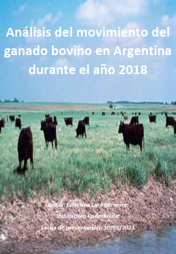

# Proyecto de Análisis

El proyecto plantea una hipótesis e intenciones en los objetivos específicos, alcanzando el objetivo general a lo largo del trabajo. Un tablero de control muestra la comercialización de ganado bovino en Argentina en 2018, con movimientos por provincia, departamento, tipo de agro-negocio y trimestre para apoyar decisiones ganaderas.

## Informe

Puedes ver una aproximaciòn estàtica del informe en pdf que debe deployarse en Power BI para ser interactivo. (.pbix)

! [Abrir el informe en PDF](Archivos/Informe_en_POOWER_BI/Documentaciòn_Power_BI/TRABAJO FINAL_LARA_LEDESMA_MGB_2018.pdf)

  

